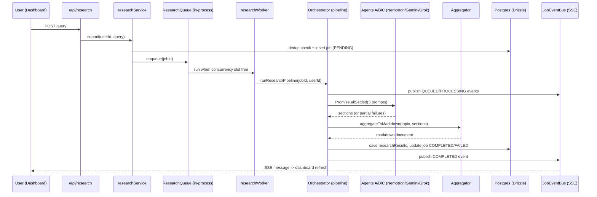

# Architecture

Brain Freeze is an asynchronous, multi-agent AI research platform. A user submits a query, the request is queued, three LLM-backed agents research it in parallel in the background, and results are aggregated into a single markdown document — with live progress pushed to the client over SSE.

## High-level flow

## Layers

- **`src/db`** — Drizzle schema + Postgres client singleton (dev-safe global caching). Also starts a 5-minute `setInterval` keep-alive ping (`select 1`, `unref()`'d, cached on `globalThis`) so managed providers that suspend on idle (e.g. Neon's 5-minute auto-suspend) stay warm.
- **`src/providers`** — Strategy + factory pattern for LLM providers.
  - `types.ts`: `LLMProvider` interface, `ProviderError`.
  - `keyManager.ts`: API key rotation pool with cooldown-based failover (env vars `PROVIDER_KEY`, `PROVIDER_KEY_1..10`).
  - `implementations.ts`: Gemini/Nemotron (via OpenRouter)/Grok concrete providers, each falling back to deterministic mock output when no key is configured or the call fails.
  - `providerFactory.ts`: `createProvider(name)` exhaustive factory.
- **`src/pipeline`** — Orchestration (Pipeline + Observer patterns).
  - `agents.ts`: 3 agent definitions — broad factual (Nemotron), technical deep-dive (Gemini, web-search grounded), current developments (Grok, live-search grounded) — each with its own subject-aware prompt builder that generalizes across topics, products, companies, sectors, people, and events.
  - `orchestrator.ts`: runs agents in parallel via `Promise.allSettled`, publishes progress at every stage, handles all-agents-failed case.
  - `eventBus.ts`: global `EventEmitter`-based pub/sub keyed by userId, consumed via native SSE.
- **`src/aggregator`** — Merges per-agent sections into one structured markdown document with references footer.
- **`src/queue`** — In-process FIFO queue with configurable concurrency (`WORKER_CONCURRENCY` env var). Designed to be swapped for Redis/BullMQ/SQS without changing calling code.
- **`src/workers`** — Wraps the orchestrator call with queue-level error handling.
- **`src/repositories`** — Isolates all Drizzle queries (jobs, results, provider logs).
- **`src/services`** — Business logic: submit (dedup + create + enqueue), list, cancel, remove.
- **`src/auth`** — NextAuth v5 (beta): Credentials (bcrypt) + Google OAuth, JWT sessions, `session.user.id` augmentation.
- **`src/components`** — `marketing/` (landing page + WebGL/GSAP), `auth/` (login/register forms), `dashboard/` (job cards, SSE hook, submit form), `ui/` (shared Button/Input/StatusPill), `three/` (shader background), `providers/` (NextAuth session provider wrapper).

## Security

- **`middleware.ts`** — IP-based rate limiting (`src/lib/rateLimit.ts`, in-memory fixed window, single-instance) applied to `POST /api/register`, `POST /api/research`, and `POST /api/auth/callback/credentials` to block signup spam, job-flood cost abuse, and credential brute-forcing. Swap for a Redis-backed limiter (e.g. Upstash) before running multiple instances.
- **`next.config.ts`** — sends `X-Content-Type-Options`, `X-Frame-Options: DENY`, `Referrer-Policy`, `Permissions-Policy`, and HSTS on every response.
- Route protection: `/dashboard/**` is guarded in `dashboard/layout.tsx` (server-side `auth()` + `redirect("/login")`); every API route re-checks `auth()` independently rather than relying on a shared middleware guard. `/login` and `/register` redirect authenticated users to `/dashboard`.
- Ownership checks: job read/update/delete routes verify `job.userId === session.user.id` (repository `delete()` also scopes the `WHERE` by `userId` as defense in depth) and return `404` (not `403`) on mismatch to avoid leaking job existence.

## Real-time updates

No WebSocket server: the dashboard opens a native `EventSource` against `/api/events` (a `ReadableStream`-based SSE route with 25s keepalive). Any pipeline stage change publishes to `JobEventBus`, which fans out to all SSE connections for that user; the client triggers a lightweight data refresh on any message rather than trying to reconcile partial state client-side.

## Duplicate detection

`src/lib/normalize.ts` normalizes queries (lowercase, trim, strip punctuation, collapse whitespace) before dedup lookup in `jobsRepository.findPendingDuplicate`, preventing duplicate in-flight jobs for the same effective query.

## Design system

Cinematic Dark Luxury + Organic/Generative WebGL + Kinetic Typography + Brutalism, tokens defined as CSS custom properties in `src/app/globals.css` (`--bg`, `--ink`, `--accent` warm gold, `--pulse` processing-state teal). Structural surfaces (nav bars, cards, forms, panels) use a single hard-edge `.panel` primitive (`border-2 border-line-strong`, no rounded pills, no glassmorphism/neumorphism) shared across marketing, auth, and dashboard so the whole app reads as one system instead of a generic SaaS template. Fonts: Fraunces (display), Inter (text), IBM Plex Mono (mono, used for uppercase eyebrow/label microcopy), loaded via `next/font/google` in `src/app/fonts.ts`. Motion: GSAP + `@gsap/react` (`useGSAP`) for kinetic typography and scroll reveals, a magnetic-cursor button (`MagneticButton`) as the signature microinteraction, `gsap.matchMedia()` + CSS `prefers-reduced-motion` for accessibility. `ShaderBackground` (React Three Fiber, dynamically imported with `ssr:false`) renders a domain-warped-noise "neural mass" with a traveling synaptic-pulse lattice and a subtle falling code-rain layer — an abstract, matrix-like rendering of the brain — used full-bleed on the landing hero and on `/login` and `/register`. `CryoField`/`ShaderBackground` intensity is intentionally kept low (dim glow, darker vignette) so it reads as an ambient backdrop rather than competing with foreground content.